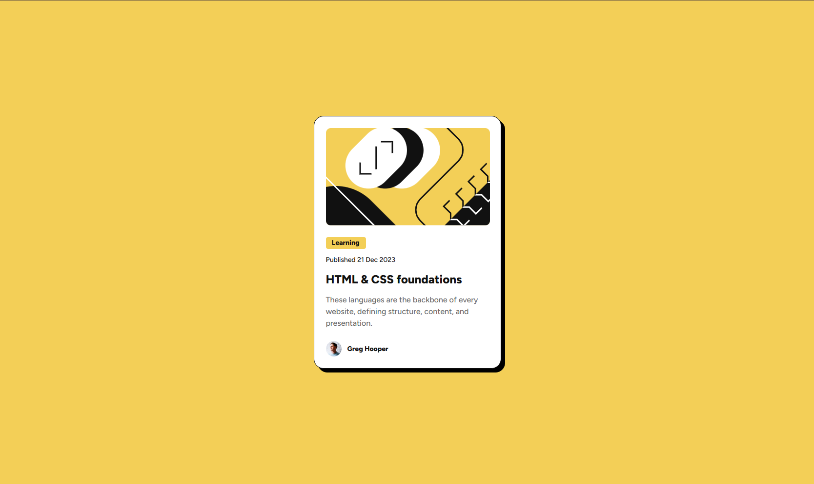

# Frontend Mentor - Blog preview card solution

This is a solution to the [Blog preview card challenge on Frontend Mentor](https://www.frontendmentor.io/challenges/blog-preview-card-ckPaj01IcS).

## Table of contents

- [Overview](#overview)
  - [The challenge](#the-challenge)
  - [Screenshot](#screenshot)
  - [Links](#links)
- [My process](#my-process)
  - [Built with](#built-with)
  - [What I learned](#what-i-learned)
  - [Useful resources](#useful-resources)
- [Author](#author)

## Overview

### The challenge

Users should be able to:

- See hover and focus states for all interactive elements on the page
- Provide responsive design without using media queries

### Screenshot



### Links

- Live Site URL: [Add live site URL here](https://your-live-site-url.com)

## My process

### Built with

- Semantic HTML5 markup
- CSS custom properties
- Further use of Flexbox
- The use of clamp() to provide responsive design without using media queries
- :hover pseudo class to provide necessary interactive functionality

### What I learned

Use this section to recap over some of your major learnings while working through this project. Writing these out and providing code samples of areas you want to highlight is a great way to reinforce your own knowledge.

Using the :hover pseudo class to provide interactivity:

```css
.card__content-heading:hover {
  color: var(--clr-Yellow);
  cursor: pointer;
}
```

Using the clamp() function to provide smooth responsive design:

```css
.card__content-heading {
  color: var(--clr-Gray-950);
  font-size: clamp(20px, 18.5915px + 0.3756vw, 24px);
  ... ...;
}
```

### Useful resources

- [Clamp Calculator](https://utopia.fyi/clamp/calculator?a=320,1440) - This helped me to generate the CSS clamp coefficents based on custom viewport height, width and min, max px inputs.

## Author

- Frontend Mentor - [@yourusername](https://www.frontendmentor.io/profile/yourusername)
